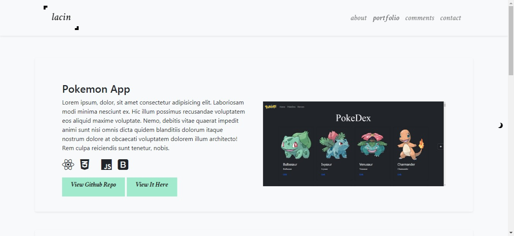
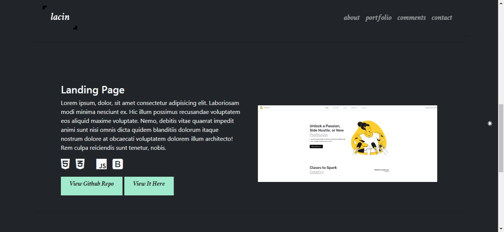
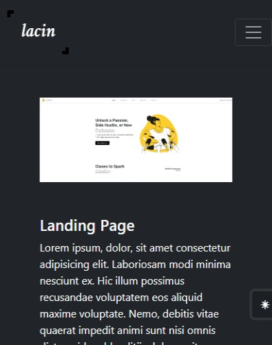

# ercument-lacin-portfolio

## Demo 
[Live](https://ercument-lacin-portfolio.netlify.app/)

## How to Get Started

```
$ git clone https://github.com/ercumentlacin/ercument-lacin-portfolio
$ cd /ercument-lacin-portfolio
$ npm install
$ npm start

```

## Note
- It continues to be developed.

## Tech
My portfolio site uses a number of libraries.
- [ReactJS](https://reactjs.org/) - Frontend Library for awesome apps!
- [Bootstrap5](https://getbootstrap.com/) - The world’s most popular front-end open source toolkit

## ScreenShots





